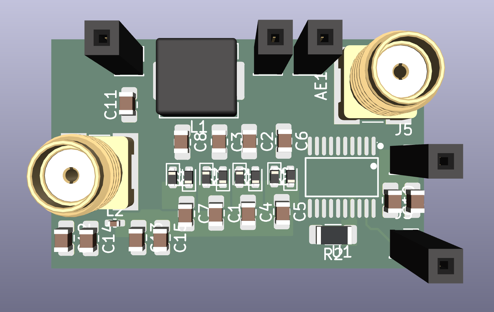
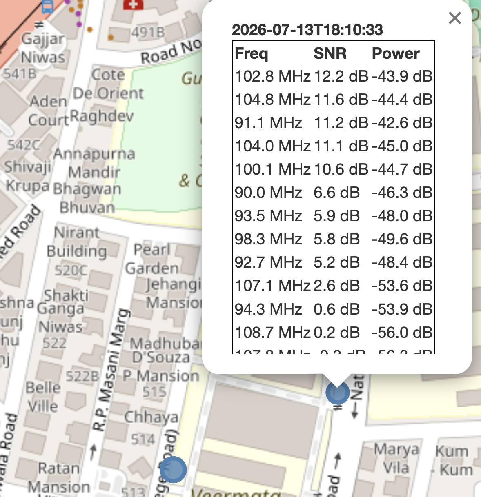
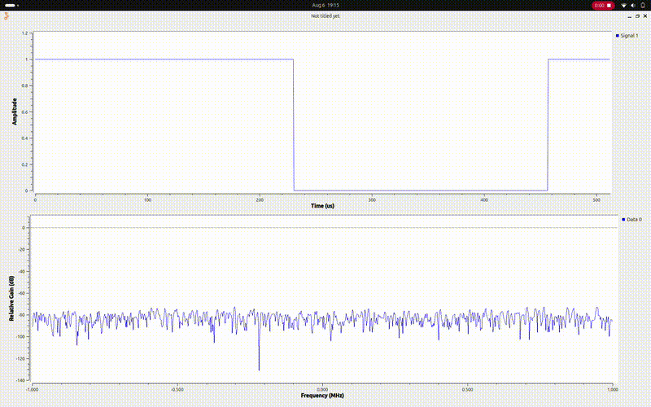

# Project AURA

### Ambient Backscatter Communication for Battery-Free Wireless Devices

---

## **Overview**

Ambient backscatter communication enables a device to transmit data without a battery, a power cord, or a dedicated transmitter. While the concept may sound like science fiction, it represents a practical and active area of wireless engineering.

**Project AURA** explores a class of electronics that operate entirely off the grid, communicating using energy "borrowed" from the environment. Rather than generating their own radio waves, AURA devices piggyback on the ambient RF signals already surrounding us — Wi-Fi, television, and cellular transmissions. The principle is analogous to signaling with a mirror: the light is not generated, only reflected, in a controlled and meaningful way.

By making microscopic, deliberate changes to how an antenna reflects incident RF energy, an AURA device is able to encode and transmit data using virtually zero power of its own.

## **What This Project Covers**

Building AURA sits at the intersection of RF engineering, embedded systems, and signal processing. The project involves:

- Designing analog and RF front-end circuitry for signal reflection and modulation
- Programming microcontrollers to drive backscatter modulation in real time
- Capturing, decoding, and analyzing real ambient RF signals
- Investigating near-zero-power techniques that push the limits of low-power wireless design

## **Why It Matters**

Ambient backscatter challenges the conventional assumption that wireless communication requires an active transmitter and a dedicated power source. By demonstrating how information can travel invisibly through existing RF infrastructure, this project establishes a practical path toward self-sustaining, maintenance-free sensor and tag networks.

---

## **Outputs**

### 1. Voltage Multiplier

Design and validation of a voltage multiplier stage for harvesting and stepping up ambient RF energy.

### 2. Survey on FM Signal Strengths

A field survey of ambient FM band signal strength across multiple locations, logging frequency, SNR, and power for each site to identify viable ambient RF sources for backscatter.

### 3. Successful OOK Communication Between Two SDRs

Demonstration of On-Off Keying (OOK) modulation successfully transmitted and received between two software-defined radios.

---

This repository documents the design, hardware, and firmware work behind Project AURA.
